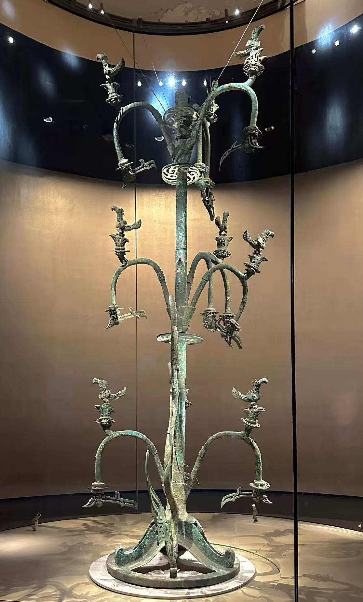

# 🌳 AI-Fusang · 陪伴你的代码一点点成长为一棵神话之树

> 将代码可视化为东方神话中的世界之树
> 一眼定位 Bug，瞬间捕捉问题，守护项目，见证生长
> 在项目完成、上线之时，额外收获一棵独一无二的世界之树数字藏品

[](【待填：Demo地址】)
[](https://github.com/Firecangshu/ai-fusang)
[](./LICENSE)

---

## 🏮 扶桑（Fusang）：当三千年的神树，在代码中复活

提到世界树，你一定听说过北欧神话的 **Yggdrasil**。

但在东方，我们也有一棵连接天地的"世界树"——它叫做**扶桑**。

这不可不止是神话。

三千年前，中国古人真的铸造了它的形态。在中国四川省德阳市三星堆遗址，考古学家挖出了一棵高达四米的青铜神树——



*三星堆青铜神树（公元前 1600 年），高近 4 米——这就是 AI-Fusang 的视觉原型*

那是一个公元前 1600 年的杰作，证明了我们的祖先曾相信：太阳从这棵树上升起，神龙守护着这颗神树，沿着树干盘旋。

今天，我们把这棵神树带进了你的代码库。

忘掉那些枯燥的日志吧。

你的每一行代码，都会让这棵古树抽出新枝，你的每一个目标，都会让这棵古树焕发光芒。那条古老的盘龙，此刻化身为你的监控卫士，时刻守护着系统的脉搏。而你遇到的每一个 Bug，也不再只是冰冷的错误提示，而是树上显眼的红色阻塞节点…

当项目交付的那一刻，你收获的将不止是可运行的软件——而是一棵完全由你亲手"种"出来的 3D 代码孪生树。

它是你逻辑的具身，是你智慧的结晶。

---

## ✨ 它能为你带来什么？

| 身份 | 核心价值 | 典型场景 |
|------|----------|----------|
| 👨‍💻 **资深开发者** | 一眼锁定 Bug 源头，可视化调用链路 | 大型项目重构 |
| 🤖 **AI 编程新手** | 把抽象代码变成具象结构，降低学习曲线 | 新手 onboarding |
| 📊 **技术负责人** | 全局掌握架构健康度，提前识别风险 | 项目进度汇报 |

**核心体验闭环**：写代码 → 看树生长 → 红点告警 → 点击修复 → 枝繁叶茂 → 成就感拉满

---

## 🆚 为什么选 Fusang？（vs 其他工具）

| 对比维度 | Fusang | CodeSee | Gource |
|-----------|--------|---------|--------|
| **实时更新** | ✅ 写代码即更新 | ✅ | ❌ 只支持 Git 历史 |
| **Bug 可视化** | ✅ 红色脉冲 + 跳转 | ⚠️ 需插件 | ❌ 不支持 |
| **三维展示** | 🔜 V5 规划中 | ❌ | ❌ |
| **文化特色** | ✅ 东方神话美学 | ❌ | ❌ |
| **开源协议** | ✅ MIT | ❌ 闭源 | ✅ GPL |

---

## 🎬 15 秒快速预览

*（此处放置 demo.gif 动图）*

*点击红色脉冲的 Bug 节点 → 查看错误链路 → 触发 AI 修复 → 见证神树重焕生机*

---

## 🧩 核心功能

| 功能 | 说明 | 状态 |
|------|------|------|
| 🔴 阻塞节点脉冲告警 | 红色呼吸动效标记问题代码，直指 Bug 根源 | ✅ V3 已实现 |
| 🐉 盘龙守护监控 | 龙身沿树盘绕，异常传播时龙眼快闪预警 | ✅ V3 已实现 |
| 🎉 修复庆祝动画 | 修复成功触发白光→绿光→金粒子升腾动效 | ✅ V3 已实现 |
| 🖱️ 一键跳转代码行 | 点击任意节点，直接跳转至编辑器对应代码行 | ✅ V4 已实现 |
| 🤖 AI 辅助修复 | 每个错误卡片内置 AI 修复入口，自动生成修复方案 | ✅ V4 已实现 |
| 🌱 代码实时生长 | 树形、高度、密度直接映射代码行数与复杂度 | 🔜 V5 规划中 |

---

## 🚀 快速开始

### 方式一：在线体验（推荐）
无需安装，直接访问：
👉 **[ai-fusang.demo.com](【待填：Demo地址】)**

### 方式二：本地运行
```bash
git clone https://github.com/Firecangshu/ai-fusang.git
cd ai-fusang
python3 -m http.server 8080
```
浏览器打开 `http://localhost:8080` 即可使用。

### 方式三：接入你的编辑器
支持 VS Code / Monaco Editor 接入，完整协议见 [接入指南](./API.md)。

---

## 📖 使用指南

### 🌱 新手入门
1. 打开演示页，自动播放 15 秒完整流程动画
2. 点击右上角「模拟阻塞」，手动生成一个测试 Bug
3. 点击红色脉冲节点，右侧弹出错误详情与调用链路卡片
4. 点击「AI 修复」，观看完整修复庆祝动画

**快速参考：神话意象对照**
- 🌳 树干与分枝 = 代码模块与函数
- 🌱 金色花苞 = 预留接口 / 占位方法
- ☀️ 树顶金乌 = 程序出口 / 事件触发器
- 🐉 盘绕的龙 = 实时系统监控器

### 👨‍💻 开发者接入
通过 `postMessage` 实现编辑器（宿主）与扶桑（iframe）的双向通信：

```javascript
// 从编辑器向扶桑推送节点更新
fusangIframe.contentWindow.postMessage({
  type: 'FUSANG_UPDATE_NODES',
  nodes: [/* 你的 AST 节点 */],
  errors: [/* 语法/运行时错误 */]
}, '*');

// 监听扶桑的跳转代码指令
window.addEventListener('message', (e) => {
  if (e.data.type === 'FUSANG_JUMP_TO_CODE') {
    jumpToCode(e.data.file, e.data.line);
  }
});
```

完整协议规范：[postMessage API 文档](./API.md)

---

## 📊 MVP 版现状 + 未来规划

### ✅ V4 — 当前版本（v1.8）
- 5 层通用代码模型可视化
- 阻塞节点脉冲 + 盘龙监控动画
- 交互式信息卡片 + 修复庆祝效果
- 15 秒自动演示循环
- postMessage API 完整接入（9 个信号，外部系统可控制）
- 中英双语 i18n 全覆盖
- 三种模式：演示 / 调试 / 接入

#### ⚠️ 已知问题 / 限制
- 🔜 **Demo 是手动模拟的** —— 真实数据接入需要宿主程序发信号（API 已就绪，见 API.md）
- 🔜 **不支持超大型项目**（>1000 个节点会卡） —— 未来版本优化
- 🔜 **不支持移动端触控** —— 正在开发中
- ⚠️ **AST 自动解析尚未实现** —— 当前需手动配置 tasks.json

### 🔜 未来规划
| 版本 | 核心能力 | 用户价值 |
|------|----------|----------|
| V5 | 真实 AST 解析，自动生成树 | 你的代码，自动长成对应的树 |
| V6 | WebGL 3D 渲染，自由旋转缩放 | 沉浸式漫游你的代码架构 |
| V7 | 运行时性能可视化 | 树随 CPU/内存负载动态「呼吸」 |
| V8 | AI 对话联动 | 提问问题 → 对应分枝自动高亮 |

### 🎁 终极形态
当你完成项目交付时，会同时收获一棵完全长成的扶桑树。
每一根枝干、每一片叶子，都对应着你写下的函数与逻辑。
你可以旋转它、导出它、收藏它——
这是专属于你的、由代码铸成的数字藏品。

---

## 🖥️ 浏览器兼容性

| 浏览器 | 版本要求 | 状态 |
|---------|-----------|------|
| Chrome / Edge | 90+ | ✅ 完全支持 |
| Firefox | 90+ | ✅ 完全支持 |
| Safari | 15+ | ✅ 完全支持 |
| 移动端 | iOS Safari / Chrome Android | ⚠️ 部分支持（触控优化中）|

---

## 🛠️ 技术栈
- 纯 Canvas 2D 渲染，零第三方依赖
- `postMessage` 实现跨上下文双向通信
- `requestAnimationFrame` 驱动 60fps 流畅动画
- 原生适配 GitHub 暗色主题 `#0d1117`

---

## 💬 获取帮助

- 🐛 **发现 Bug？** → [提交 Issue](https://github.com/Firecangshu/ai-fusang/issues/new)
- 💡 **有新想法？** → [发起 Discussion](https://github.com/Firecangshu/ai-fusang/discussions)
- 📧 **商务合作？** → 发邮件到 `157034356@qq.com`

---

## 🤝 参与贡献
欢迎提交 Issue 与 Pull Request，贡献前请阅读 [贡献指南](./CONTRIBUTING.md)。

1. Fork 本仓库
2. 创建特性分支 (`git checkout -b feature/amazingFeature`)
3. 提交你的改动 (`git commit -m 'Add some AmazingFeature'`)
4. 推送至分支 (`git push origin feature/amazingFeature`)
5. 发起 Pull Request

---

## 📄 开源协议
本项目基于 **MIT License** 开源，详见 [LICENSE](./LICENSE) 文件。

---

## ⭐ Star 历史
如果这个项目对你有帮助，欢迎点一个 Star，这会帮助更多人发现它。

[](https://star-history.com/#Firecangshu/ai-fusang&Date)

---

❤️ 灵感源自三星堆青铜神树——来自中国、距今 3000 年的考古奇迹
